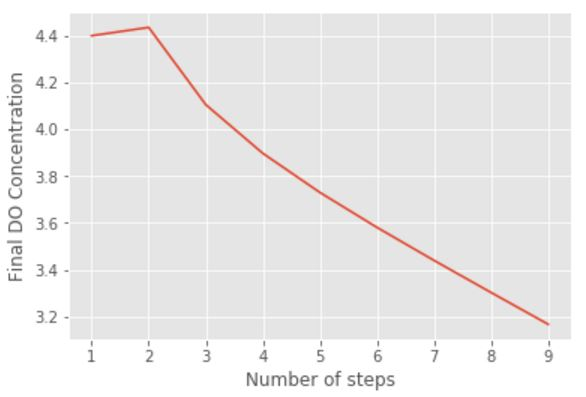

# Aerator for Ocotal

"It takes 0.14 mg/L of oxygen to oxidize 1 mg/L of iron. Iron concentration above 0.3 mg/L is unacceptable"

The highest concentration of iron recorded in Ocotal is 13 mg/L.


```python
# %%
# imports
from aide_design.play import *
import matplotlib.pyplot as plt
from scipy import interpolate
Q_plant = 60*(u.L/u.s)
C_iron_max = 13*(u.mg/u.L)
CO2_increase_min = 0.14*C_iron_max

print(CO2_increase_min)
```
The minimum addition of oxygen is 1.82 milligram / liter.


## Cascade Design

The following is based on [this](https://ocw.tudelft.nl/wp-content/uploads/Aeration-and-gas-stripping-1.pdf) paper and [this](http://mimoza.marmara.edu.tr/~bilge.alpaslan/enve301/Lectures/Chp_5.pdf) presentation.


```python

# %%

Q_unit_casc_max = 150*(u.m**3/u.hour)/u.m
width_cutout = .2*u.m
width_tooth = .1*u.m
depth_tooth = .1*u.m
L_weir_min = (Q_plant/Q_unit_casc_max).to(u.m)
n_cutouts = np.ceil(L_weir_min/width_cutout)
L_total = n_cutouts*(width_tooth+width_cutout)+10*u.cm

flow_cutout = Q_plant/n_cutouts
headloss_cutout = pc.headloss_weir(flow_cutout,width_cutout).to(u.mm)

headloss_cutout.to(u.m)

DO_initial = 0*(u.mg/u.L) #lacking data, assuming something low
DO_sat = 8*(u.mg/u.L) #approximate average sat. conc. based on temperature
h = np.array([0.2,0.4,0.6,0.8,1.0,1.2,10])*u.m
K = np.array([.14,.25,.36,.46,.51,.55,1])# K values from table in TU Delft paper
interp_k = interpolate.interp1d(h,K,'slinear',fill_value='extrapolate')

#Assume a reasonable total height, determine the number of steps into which that height should be divided given influent and target effluent DO concentration
h_total = 1.3*u.m
n_steps_array = np.array(np.arange(1,10,1))
h_steps_array = h_total/n_steps_array-depth_tooth

#Interpolate to get K values
K_array = interp_k(h_steps_array)

#Get the final dissolved oxygen concentration for each step height
def DO_final(DO_sat,DO_initial,K,n):
  DO = DO_sat-(DO_sat-DO_initial)*(1-K)**n
  return DO

DO_final_list = []

for K, n in zip(K_array, n_steps_array):
  DO_final_list.append(DO_final(DO_sat,DO_initial,K,n).magnitude)


plt.plot(n_steps_array,DO_final_list)
plt.xlabel('Number of steps')
plt.ylabel('Final DO Concentration')
plt.show()
```

```python
# %%

i = DO_final_list.index(max(DO_final_list))
n_steps = n_steps_array[i]
h_water_fall = h_steps_array[i]


delta_DO = DO_final_list[i]*(u.mg/u.L)-DO_initial
#Find the dimensions of the troughs

critical_depth = ((flow_cutout**2/(width_cutout**2*pc.gravity))**(1/3)).to(u.m)
v_jet = flow_cutout/(width_cutout*critical_depth)

ti_jet = np.sqrt((2*h_water_fall)/pc.gravity)
width_jet = v_jet*ti_jet
width_trough = 2*width_jet.to(u.m)
depth_trough = (2/3)*h_water_fall


print('The increase in dissolved oxygen concentration is {}'.format(delta_DO))
print('The minimum horizontal length of the aerator is {}'.format(L_total.to(u.m)))
print('The height the water falls per step (h) is {}'.format(h_water_fall.to(u.m)))
print('The number of steps is {}'.format(n_steps))
print('The minimum width (B) of each step is {}'.format(width_trough.to(u.m)))
print('The minimum depth (H) of each step is {}'.format(depth_trough.to(u.m)))
```
The increase in dissolved oxygen concentration is 4.436 milligram / liter  
The minimum horizontal length of the aerator is 2.5 meter  
The height the water falls per step (h) is 0.55 meter  
The number of steps is 2  
The minimum width (B) of each step is 0.4799 meter  
The minimum depth (H) of each step is 0.3667 meter  
