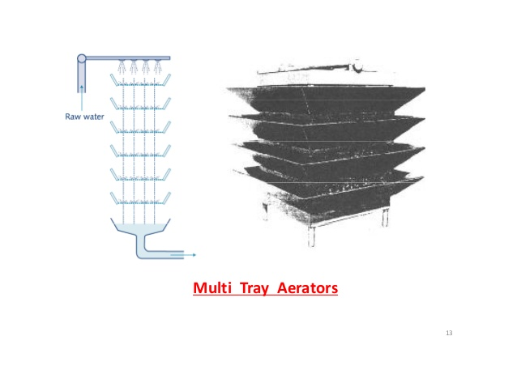

## Multiple-tray tower aerator
"Multiple-tray aerators are constructed of a series of trays, usually three
to nine, with perforated, slot or mesh bottoms. The water first enters a distributor tray and then falls from tray to tray, finally entering a collection basin at the
base. The vertical opening between trays usually
ranges from 12 inches to 30 inches. Good distribution
of the water over the entire area of each tray is essential. Perforated distributors should be designed to provide a small amount of head, approximately 2 inches
on all holes, in order to insure uniform flow. In aerators with no provision for forced ventilation, the trays are usually filled with 2- to 6-inch media, such as coke,
stone, or ceramic balls to improve water distribution
and gas transfer and to take advantage of the catalytic
oxidation effect of manganese oxide deposits in the
media. The water loading on aerator trays should be in
the range of 10 to 20 gpm per square foot. Good, natural ventilation is a requirement for high efficiency."

(Taken from [this](http://ec.europa.eu/echo/files/evaluation/watsan2005/annex_files/USACE/USACE6%20-%20Water%20Treatment.pdf) paper)


*Aireadores de múltiples bandejas normalmente se están construidos de una serie de 3 a 9 bandejas, con fondos perforados, ranurados, o de malla. El agua entra la bandeja más arriba y cae entra bandejas, finalmente entrando una pila recolectora al fondo. El espacio vertical entre bandejas es normalmente 12 a 30 pulgadas. Distribución buena del agua sobre todo el area de la bandeja es esencial. Se debe diseñar la bandeja para proveer una cantidad de carga, aproximadamente 2 pulgadas, encima de las perforaciones, para asegurar caudal uniforme. En aireadores sin ventilación forzada, normalmente se llena las bandejas con una media de 2 a 6 pulgadas para mejorar la transferencia de gas y aprovechar el efecto de oxidación del óxido de magnesio en la media. La carga de agua es típicamente en el orden de 10 a 20 galones/minuto/pie cuadrado. Buena ventilación es importante para alta eficiencia.*

Example of a multi-tray aerator:



```python
from aide_design.play import *
Q_plant = 60*u.L/u.s
water_depth_in_tray = 2*u.inch

max_loading = 20*((u.gal/u.min)/u.foot**2)
min_area_per_layer = float(np.asarray((Q_plant/max_loading).to(u.m**2)))
total_orifice_area = pc.area_orifice(water_depth_in_tray,exp.RATIO_VC_ORIFICE,Q_plant)

side_length = np.sqrt(min_area_per_layer)

drill_array = np.array(mat.DIAM_DRILL_ENG*(1/u.inch))*u.inch
n_orifice_array = np.ceil(total_orifice_area/pc.area_circle(drill_array))

float(np.asarray(side_length))
float(np.asarray(total_orifice_area))
```
Final parameters:

| Minimum side length | Total orifice area |
| ----------------- | ------------------ |
|2.1018157898540983 m|0.09541211196990121 m<sup>2</sup>|
